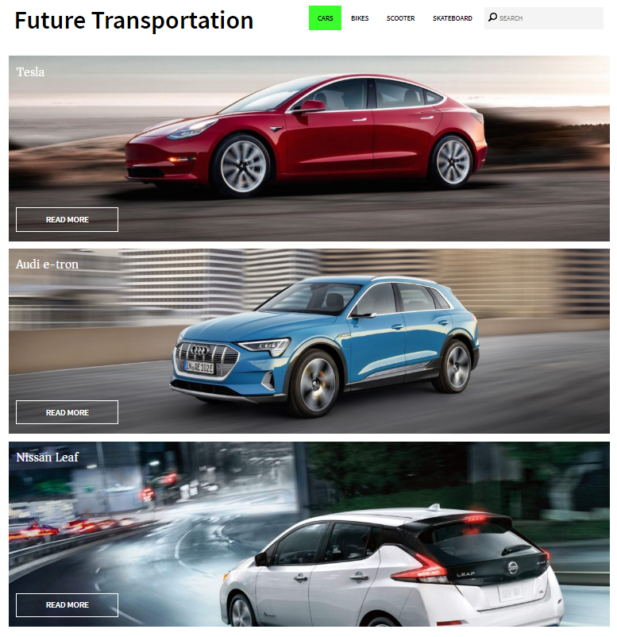
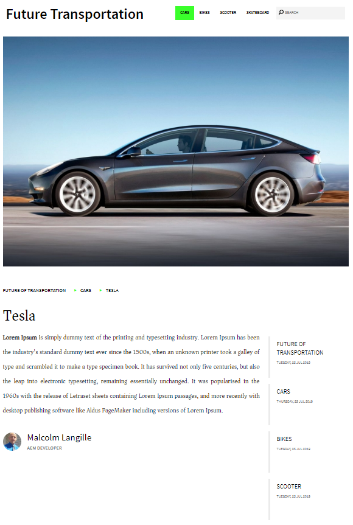

# My Sample AEM Project - Malcolm Langille

This is my implementation of the weekend AEM tutorial. The content structure is included 
and can be exported to the server.

https://docs.adobe.com/content/help/en/experience-manager-learn/getting-started-wknd-tutorial-develop/overview.html

## How to build

If you have a running AEM instance you can build and package the whole project and deploy into AEM with  

    mvn clean install -PautoInstallPackage
    
## Home Page

## Landing Page

## Article Page

Malcolm Langille